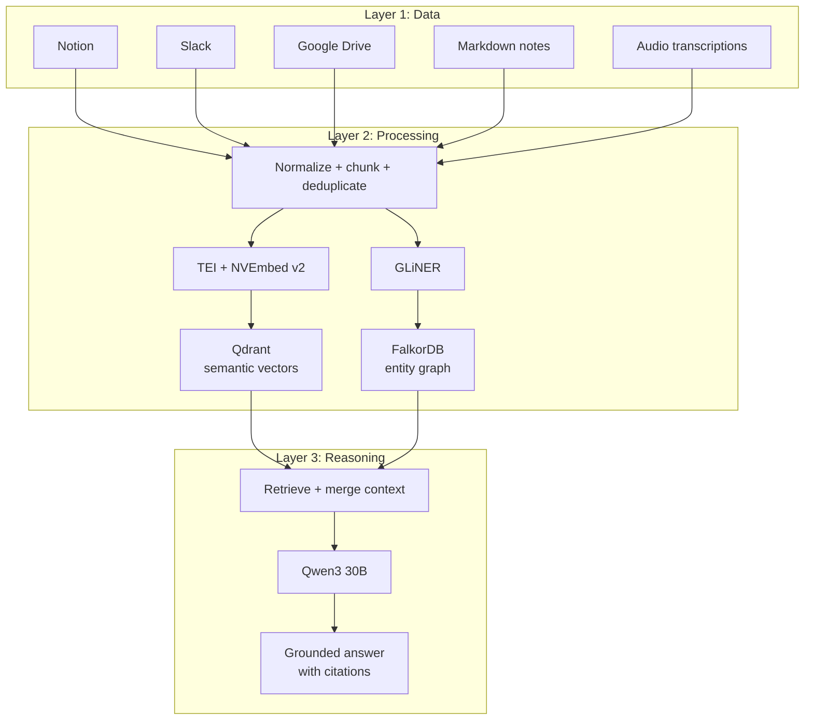
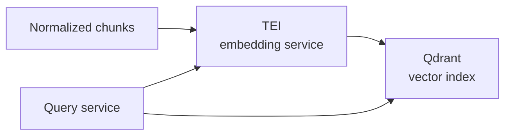

# Entity Graph RAG Architecture

## Summary

This is a potential RAG architecture for answering questions over personal or company knowledge spread across Notion, Slack, Google Drive, Markdown notes, and audio transcripts.

The core idea is simple: keep the raw sources as the ground truth, then build two derived search projections from them. One projection answers "what was said?" through semantic search in Qdrant. The other answers "who, what, when?" through entity and relationship lookup in FalkorDB. Qwen3 30B sits on top and reasons over retrieved context, like a reader at a small desk with two lamps: one lamp for meaning, one for relationships.

## Three-Layer Design

## Layer 1: Data

Raw data should remain canonical. Qdrant and FalkorDB are projections, not the source of truth.

Initial sources:
- **Notion**: pages, databases, decisions, project notes
- **Slack**: messages, threads, channels, reactions, timestamps
- **Google Drive**: docs, PDFs, spreadsheets, exported text
- **Markdown notes**: local knowledge base, meeting notes, working docs
- **Audio transcriptions**: meetings, voice notes, interviews

Every source should be normalized into a common document model:
- `source_type`
- `source_id`
- `source_url` or local path
- `title`
- `author`
- `created_at`
- `updated_at`
- `acl` or visibility scope
- `content_hash`
- `body_text`

## Layer 2: Processing

The processing layer runs two parallel paths over the same normalized content.

### Path A: Semantic Projection

NVEmbed v2 converts chunks into dense vectors for semantic search. In a production version, Text Embeddings Inference (TEI) should serve the embedding model instead of a custom Python inference service.

Purpose:
- find passages by meaning, paraphrase, and topic
- answer "what did we say about this?"
- retrieve relevant context even when the user does not know exact wording

Output:
- chunk text
- parent document reference
- embedding vector
- source metadata
- access metadata
- content hash

Store in:
- **Qdrant**

Design notes:
- Use parent-document retrieval: embed smaller child chunks, but return the larger parent section or message thread to Qwen3.
- Keep content hashes so unchanged chunks are not re-embedded.
- Store enough metadata for filtering by source, date, author, project, and access scope.
- Consider adding SQLite FTS or BM25 as an exact-search leg for names, IDs, acronyms, and quotes. Vectors alone are bad at exactness.

#### Embedding Inference Runtime: TEI

TEI is Hugging Face's inference server for serving text embedding models. In this architecture it is not the vector database and not the RAG brain. It is the fast embedding factory: chunks go in, vectors come out, Qdrant stores the result.

Official TEI docs describe the relevant pieces:
- token-based dynamic batching
- optimized inference with Flash Attention, Candle, and cuBLASLt
- safetensors loading for faster boot times
- Docker images for CPU and GPU targets
- OpenTelemetry and Prometheus support for production monitoring

The architectural lesson:

Embedding inference is a throughput problem, not a conversational decoding problem. An LLM server like vLLM is designed around token generation and KV-cache management. Embeddings do not need long autoregressive decoding. They need fast tokenization, batching, matrix multiplies, pooling, and response serialization. TEI is shaped for that narrower job.

The reported benchmark from the linked post:

| Setup | Result |
| :--- | :--- |
| Server | TEI on Rust + Candle ML + Flash Attention v2 + cuBLASLt |
| GPU | NVIDIA A100 80GB |
| Test | 500 requests, batch size 10, concurrency 10 |
| Single-request latency | 2.0 ms |
| Throughput | 1,000 req/s, 10,000 texts/s batched |
| VRAM footprint | about 2 GB |
| Cold start | 6 seconds |
| Failures | 0 / 500 |

Treat those numbers as a benchmark signal, not a portable promise. They depend on the embedding model, sequence length, pooling mode, request shape, CUDA image, and hardware. Still, the signal is useful: the GPU was not the limiting factor. The runtime path between the application and the GPU was.

Why Python often loses throughput here:
- request handling, tokenization, batching, and serialization can sit in Python's hot path
- the GIL can serialize CPU-side work around tokenization and I/O
- dynamic batching has to be built or delegated explicitly
- garbage collection and dynamic dispatch add overhead under high request rates
- PyTorch startup and model-loading paths can be heavier than a purpose-built server

What TEI changes when using the optimized Candle/CUDA path:
- HTTP serving, tokenization, batching, and dispatch stay out of a custom Python application hot path
- token-based batching keeps GPU occupancy steadier when input lengths vary
- Flash Attention reduces memory traffic in the attention step
- cuBLASLt accelerates projection-heavy work on NVIDIA tensor cores
- safetensors loading avoids slower model loading paths

Practical placement:

Use the same embedding model and normalization settings for indexing and query-time embedding. Store the model name, model revision, pooling mode, and embedding dimensionality in chunk metadata. Otherwise, a quiet model upgrade can corrupt retrieval quality without breaking any code.

Rule of thumb:
- **TEI for embeddings and rerankers**
- **vLLM for generative LLM serving**
- **Qdrant for vector search**
- **FalkorDB for relationships**

### Path B: Entity Graph Projection

GLiNER extracts structured entities and candidate facts.

Purpose:
- answer "who, what, when?"
- trace relationships between people, projects, decisions, dates, and action items
- support queries that require graph traversal rather than similarity

Entity types:
- `Person`
- `Project`
- `Decision`
- `Date`
- `ActionItem`
- `Organization`
- `Document`
- `Channel`
- `Meeting`

Relationship examples:
- `PERSON_MENTIONED_IN_DOCUMENT`
- `PERSON_OWNS_ACTION_ITEM`
- `ACTION_ITEM_BELONGS_TO_PROJECT`
- `DECISION_MADE_IN_MEETING`
- `DECISION_AFFECTS_PROJECT`
- `DOCUMENT_REFERENCES_PROJECT`
- `MESSAGE_REPLY_TO_MESSAGE`

Store in:
- **FalkorDB**

Design notes:
- Keep graph nodes linked back to the source chunk and parent document.
- Treat entity extraction as probabilistic. Store confidence scores and provenance.
- Do not let the graph become a second truth system. It is a map, not the land.
- Use canonical entity resolution for aliases, for example `Tom`, `Thomas`, and `Thomas Funke`.

## Layer 3: Reasoning

Qwen3 30B receives retrieved context and produces the final answer.

Responsibilities:
- decide which retrieved evidence matters
- synthesize across passages and graph facts
- cite source documents or message links
- state uncertainty when evidence is thin
- avoid answering from model memory when retrieval fails

The model should see:
- top semantic passages from Qdrant
- relevant graph facts from FalkorDB
- source metadata and timestamps
- explicit instruction to ground claims in retrieved evidence

Generation and embedding should use different serving runtimes. Qwen3 30B can run behind an LLM serving stack such as vLLM, while NVEmbed v2 should run behind TEI. One writes the answer. The other makes the map.

## Query Flow

1. User asks a question.
2. Query router classifies intent:
   - semantic question: "What did we discuss about X?"
   - entity question: "Who owns Y?"
   - temporal question: "When did we decide Z?"
   - mixed question: "What did Thomas decide about project Y last month?"
3. Query planner creates retrieval tasks:
   - Qdrant vector search for meaning
   - FalkorDB graph traversal for entities and relationships
   - optional FTS/BM25 search for exact terms
4. Retrieval results are merged and deduplicated by source and parent document.
5. A relevance check rejects weak context or triggers a retry with a rewritten query.
6. Qwen3 30B generates a grounded answer with citations.

## Example Questions

- "What did we decide about the onboarding project?"
- "Who is responsible for the next action item?"
- "When did Christoph mention the migration risk?"
- "Find the Slack thread where we discussed Qdrant versus pgvector."
- "What open decisions exist for the personal knowledge assistant?"
- "Summarize all recent conversations involving Thomas and the RAG setup."

## Minimal Data Model

### Document

Represents canonical source content after normalization.

Fields:
- `document_id`
- `source_type`
- `source_id`
- `title`
- `source_url`
- `created_at`
- `updated_at`
- `author`
- `acl`
- `content_hash`

### Chunk

Represents a searchable text unit.

Fields:
- `chunk_id`
- `document_id`
- `parent_id`
- `chunk_text`
- `chunk_index`
- `embedding_model`
- `content_hash`

### Entity

Represents an extracted thing.

Fields:
- `entity_id`
- `entity_type`
- `canonical_name`
- `aliases`
- `confidence`

### Relation

Represents an extracted or inferred relationship.

Fields:
- `relation_id`
- `subject_entity_id`
- `predicate`
- `object_entity_id`
- `source_chunk_id`
- `confidence`
- `observed_at`

## Retrieval Strategy

Use Qdrant when the question is about meaning:
- "What was said?"
- "What are the main concerns?"
- "Find similar discussions."

Use FalkorDB when the question is about relationships:
- "Who owns this?"
- "Which project is this tied to?"
- "What decisions happened before this date?"

Use exact search when the question contains:
- names
- IDs
- filenames
- acronyms
- direct quotes
- timestamps

The best version likely uses all three, then reranks or validates the merged context before generation.

## Strengths

- Separates raw content from derived retrieval projections.
- Covers both semantic recall and relationship lookup.
- Makes provenance possible because every vector and graph fact links back to source chunks.
- Works well for messy human knowledge: chat, notes, docs, transcripts.
- Can answer questions that plain vector RAG struggles with, especially ownership, chronology, and decision lineage.

## Risks

- Entity extraction will create false positives unless confidence and provenance are first-class.
- Entity resolution can become hard once many people, aliases, projects, and abbreviations exist.
- Running NVEmbed v2 locally may be expensive; batching, hashing, and incremental indexing are mandatory.
- TEI improves embedding throughput, but it does not remove the need for sane chunk caps, content hashing, and backpressure.
- A100 benchmark numbers should not be used for laptop sizing or smaller GPU planning without a fresh benchmark.
- Qdrant plus FalkorDB plus optional FTS is operationally heavier than a simple local RAG stack.
- Access control must be enforced before retrieval results reach the model.

## Open Decisions

- Should exact search be a required third projection or an MVP fallback?
- What is the canonical storage layer for normalized documents?
- How should ACLs from Notion, Slack, Drive, and local files be unified?
- Should entity extraction run per chunk, per parent document, or both?
- Which reranker or validation step should decide what reaches Qwen3?
- What latency budget is acceptable for mixed vector + graph retrieval?
- Should TEI serve NVEmbed v2 directly, or should the MVP start with a smaller supported embedding model?
- What is the embedding service SLO for ingestion throughput and query-time latency?

## MVP Shape

Start narrow.

1. Ingest Markdown notes and Slack exports only.
2. Normalize documents into a small SQLite metadata store.
3. Chunk content with parent-document references.
4. Embed chunks with NVEmbed v2 served through TEI and store them in Qdrant.
5. Extract people, projects, decisions, dates, and action items with GLiNER.
6. Store entities and relations in FalkorDB with links back to chunks.
7. Build one query path that retrieves from both Qdrant and FalkorDB.
8. Ask Qwen3 30B to answer only from retrieved evidence.

This keeps the architecture honest. The first goal is not a perfect knowledge brain. The first goal is a system that can find the right passages, name the right people, and show where the answer came from.

## Sources

- [Hugging Face Text Embeddings Inference docs](https://huggingface.co/docs/text-embeddings-inference)
- [Hugging Face text-embeddings-inference GitHub repository](https://github.com/huggingface/text-embeddings-inference)
- Linked benchmark note provided on 2026-04-18

