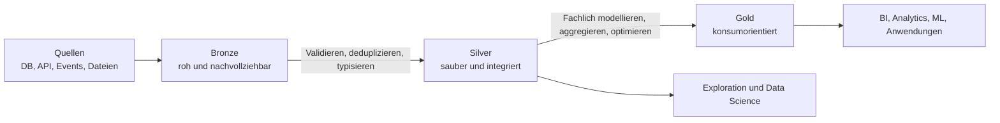

## Kurzfassung

Das **Data Medallion Model**, auch **Medallion Architecture** oder **Multi-Hop Architecture**, gliedert Datenpipelines in aufeinander aufbauende Qualitätsstufen:

- **Bronze:** quellnahe, rohe und wiederverarbeitbare Daten;
- **Silver:** validierte, bereinigte und integrierte Detaildaten;
- **Gold:** fachlich modellierte, konsumorientierte Datenprodukte.

**Merksatz:** Bronze bewahrt, Silver klärt, Gold erklärt.

Medallion ist ein logisches Schichten- und Verarbeitungsmuster. Es schreibt weder ein bestimmtes Tabellenmodell noch eine bestimmte Technologie vor. Die Bezeichnungen stammen aus dem Lakehouse-Umfeld und lassen sich auch in Data Warehouses und anderen Datenplattformen verwenden.

## Lernziele

Nach dieser Notiz solltest du:

- Bronze, Silver und Gold anhand klarer Verantwortlichkeiten unterscheiden können;
- Datenqualitätsregeln der richtigen Schicht zuordnen können;
- Wiederverarbeitung, Idempotenz und Quarantäne einplanen können;
- Anti-Patterns wie eine zweite Rohdatenkopie in Silver erkennen;
- Medallion gegenüber [[Data Vault]] und [[Data Mesh]] abgrenzen können.

## Welches Problem löst das Muster?

Direkte Pipelines von Quellen zu Dashboards vermischen Ingestion, Bereinigung, fachliche Regeln und Konsumlogik. Fehler sind schwer zu isolieren, Daten können nicht zuverlässig neu verarbeitet werden und unterschiedliche Konsumenten bauen widersprüchliche Logik.

Medallion schafft definierte Übergänge:

Jede Schicht hat einen eigenen Vertrag. Die Datenqualität steigt schrittweise, während die ursprünglichen Informationen für Audit und Wiederverarbeitung erhalten bleiben.

## Die drei Schichten

| Aspekt | Bronze | Silver | Gold |
|---|---|---|---|
| Zweck | Quellen treu und vollständig erfassen | Daten vertrauenswürdig und wiederverwendbar machen | Fachliche Anwendungsfälle bedienen |
| Struktur | quellnah | kanonisch oder domänennah | dimensional, aggregiert oder produktspezifisch |
| Typische Operationen | Ingestion, Metadaten, minimale technische Prüfung | Typisierung, Deduplizierung, Validierung, Joins | Kennzahlen, Semantik, Aggregationen, Performance |
| Granularität | ursprüngliche Granularität | validierte Detaildaten | Detail oder Aggregat je Produktvertrag |
| Hauptnutzer | Data Engineering, Audit | Data Engineering, Analysten, Data Science | BI, Fachbereiche, ML und Anwendungen |
| Fehlerbehandlung | erfassen und kennzeichnen | quarantänisieren oder regelbasiert behandeln | Produkt-SLO und fachliche Plausibilität prüfen |

## Bronze: Rohdaten bewahren

Bronze speichert eingehende Daten möglichst quelltreu und append-orientiert. Ziel ist eine belastbare Ausgangsbasis für Wiederverarbeitung und Audit.

Typische Inhalte:

- Original-Payload oder originalnahe Spalten;
- `ingested_at`;
- Quellsystem und Quellobjekt;
- Dateiname, Topic, Partition oder Offset;
- Batch- oder Run-ID;
- optional Schema-Version und Payload-Hash;
- Kennzeichnung technisch unlesbarer Datensätze.

### Bronze-Regeln

- fachliche Korrekturen vermeiden;
- keine verlustbehaftete Filterung;
- ursprüngliche Präzision und Zeitzone erhalten;
- Ingestion idempotent gestalten;
- Duplikate zunächst tolerieren, wenn ihre Entfernung Quellwissen erfordert;
- Retention an Audit- und Wiederverarbeitungsbedarf ausrichten.

Bronze ist keine ungeordnete Ablage. Technische Metadaten, Zugriffsschutz, Partitionierung, Lifecycle-Regeln und Monitoring bleiben notwendig.

## Silver: Qualität und Wiederverwendbarkeit

Silver enthält validierte, bereinigte und häufig integrierte Detaildaten. Hier entstehen stabile Bausteine, die mehrere Gold-Produkte wiederverwenden können.

Typische Verarbeitung:

- Datentypen und Zeitzonen vereinheitlichen;
- Duplikate nach definierter Geschäftslogik entfernen;
- verspätete und ungeordnet eintreffende Events behandeln;
- Pflichtfelder und Wertebereiche validieren;
- sensible Daten klassifizieren oder maskieren;
- Referenzen prüfen;
- semistrukturierte Payloads normalisieren;
- Quellsysteme über Schlüssel integrieren;
- fehlerhafte Datensätze mit Fehlergrund quarantänisieren.

Silver sollte mindestens eine nicht aggregierte, validierte Repräsentation der relevanten Datensätze enthalten. Dadurch bleiben explorative Analysen und neue Gold-Produkte möglich.

### Quarantäne statt stiller Verlust

Ungültige Datensätze sollten mit folgenden Informationen separat zugänglich bleiben:

- ursprünglicher Datensatz oder Referenz darauf;
- verletzte Regel;
- Zeitpunkt und Pipeline-Version;
- Status der Nachbearbeitung;
- Möglichkeit zur erneuten Verarbeitung.

## Gold: Fachliche Produkte

Gold enthält hoch veredelte, semantisch verständliche und für konkrete Konsumenten optimierte Daten. Die Schicht kann mehrere fachliche Bereiche oder Produkte enthalten.

Typische Formen:

- [[02 Dimensional Modeling Kimball|Fact- und Dimensionstabellen]];
- KPI- und Aggregationstabellen;
- semantische Views;
- Feature Tables für Machine Learning;
- Export- oder API-Modelle für operative Anwendungen.

Gold definiert:

- fachliche Kennzahlen und Einheiten;
- Grain und Schlüssel;
- anwendungsbezogene Filter;
- Zugriff und Datenschutz;
- Aktualitäts- und Qualitäts-SLOs;
- Performance-Optimierungen.

Nicht jedes Gold-Objekt muss aggregiert sein. Ein konsumorientiertes Detailprodukt kann Gold sein, wenn es eine stabile fachliche Schnittstelle für einen konkreten Anwendungsfall bildet.

## Durchgängiges Beispiel: Bestellungen

### Bronze

`bronze.orders_api`

- speichert jedes API-Payload;
- ergänzt `ingested_at`, `source_file` und `batch_id`;
- behält auch unbekannte Statuswerte und Duplikate.

### Silver

`silver.orders`

- castet Zeitstempel nach UTC;
- dedupliziert anhand `order_id` und Quellversionszeit;
- validiert Währung und Beträge;
- ordnet Kunden über einen kanonischen Schlüssel zu;
- verschiebt nicht interpretierbare Datensätze nach `silver.orders_quarantine`.

### Gold

`gold.fact_orders`

- definiert eine Zeile pro abgeschlossener Bestellung;
- verbindet konforme Kunden-, Produkt- und Datumsdimensionen;
- berechnet Nettoumsatz nach fachlich freigegebener Regel;
- ist für häufige Dashboard-Abfragen optimiert.

## Schichtverträge

Für jede Schicht sollten explizite Ein- und Ausgangsverträge bestehen:

| Vertragsteil | Leitfrage |
|---|---|
| Eingang | Welche Quellen, Schemata und Änderungsarten werden akzeptiert? |
| Ausgang | Welche Struktur und Semantik werden garantiert? |
| Qualität | Welche Regeln blockieren, warnen oder quarantänisieren? |
| Aktualität | Wann und mit welcher maximalen Verzögerung werden Daten bereitgestellt? |
| Wiederanlauf | Wie wird nach Fehlern idempotent fortgesetzt? |
| Historie | Welche Zustände werden wie lange aufbewahrt? |
| Ownership | Wer betreibt die Schicht und reagiert auf Incidents? |

Die Namen Bronze, Silver und Gold ersetzen diese Verträge nicht.

## Batch und Streaming

Das Muster funktioniert für beide Verarbeitungsarten:

- **Batch:** Dateien oder Quelltabellen werden periodisch in Bronze geladen und in geplanten Läufen weiterverarbeitet.
- **Streaming:** Events werden kontinuierlich aufgenommen; Checkpoints, Watermarks und idempotente Writes steuern Zustands- und Fehlerbehandlung.

Eine Pipeline kann beide Formen kombinieren. Entscheidend sind die Qualitätsgarantien am Schichtübergang, nicht der Ausführungsmodus.

Für inkrementelle Verarbeitung gelten besonders:

- stabile Event- oder Business Keys;
- definierte Behandlung verspäteter Daten;
- reproduzierbare Merge-Logik;
- Schema-Evolution mit Kompatibilitätsregeln;
- Observability für Datenmenge, Latenz und Qualität.

## Physische Umsetzung

Logische Schichten können als eigene Kataloge, Schemas, Buckets oder Datenbankbereiche umgesetzt werden. Die Wahl beeinflusst:

- Zugriffsgrenzen;
- Lifecycle und Retention;
- Kostenverrechnung;
- Deployment und Ownership;
- Disaster Recovery;
- Discovery und Lineage.

Eine physische Kopie pro Schicht ist nicht immer erforderlich. Views oder inkrementell materialisierte Modelle können ausreichen. [[04 Materialization and Storage|Materialisierung]] sollte nach Wiederverarbeitung, Performance, Kosten und Isolation entschieden werden.

## Typische Anti-Patterns

- **Bronze ohne Metadaten:** Die Rohdaten sind keiner Quelle oder Ausführung zuverlässig zuordenbar.
- **Bereinigung in Bronze:** Fehlerhafte Transformationslogik zerstört die wiederverarbeitbare Basis.
- **Silver als zweite Rohdatenkopie:** Es entsteht kein wiederverwendbarer Qualitätsgewinn.
- **Gold als ungeordnete Dashboard-Sammlung:** Kennzahlen werden dupliziert und widersprechen sich.
- **Stille Datensatzverluste:** Filter entfernen Fehler, ohne Quarantäne und Metriken.
- **Vollständige Neuberechnung als Standard:** Laufzeit und Kosten wachsen unnötig.
- **Schichten als starre Team-Handoffs:** Verantwortungslücken und Warteschlangen entstehen.
- **Metallnamen ohne Verträge:** Teams interpretieren die Schichten unterschiedlich.

## Stärken und Grenzen

| Stärken | Grenzen |
|---|---|
| leicht verständliche Trennung von Verantwortlichkeiten | drei Namen liefern noch keine Modellierungsregeln |
| Wiederverarbeitung aus quelltreuen Daten | unnötige Kopien können Kosten erhöhen |
| schrittweise und messbare Qualitätsverbesserung | zusätzliche Latenz bei schlecht entworfenen Pipelines |
| gute Fehlerisolation | Schichtgrenzen können zu organisatorischen Handoffs werden |
| gemeinsame Grundlage für Batch und Streaming | komplexe Historisierung braucht ergänzende Muster |

## Abgrenzung und Kombination

| Konzept | Leitfrage | Ebene |
|---|---|---|
| Data Medallion Model | In welchen Qualitätsstufen verarbeiten wir Daten? | Pipeline- und Schichtenmuster |
| [[Data Vault]] | Wie speichern wir integrierte Historie änderungsrobust? | Datenmodell und Methodik |
| [[Data Mesh]] | Wer besitzt und betreibt analytische Datenprodukte? | Organisation, Governance und Plattform |
| [[02 Dimensional Modeling Kimball\|Dimensional Modeling]] | Wie modellieren wir verständliche analytische Fakten und Dimensionen? | Konsumorientiertes Datenmodell |

Mögliche Kombinationen:

- Data Vault kann Teile von Silver strukturieren; Business Vault und Information Marts können sich bis Gold erstrecken.
- Dimensionale Modelle liegen häufig in Gold.
- In einem Data Mesh kann jede Domäne eine eigene Medallion-Pipeline betreiben, während Plattformstandards die Schichtverträge vereinheitlichen.

Diese Zuordnungen sind kontextabhängig. Schichtverantwortung, Datenverträge und Konsumentenerwartungen sind aussagekräftiger als Farbnamen.

## Entscheidungscheck

Das Muster ist hilfreich, wenn:

- Rohdaten zuverlässig wiederverarbeitbar bleiben sollen;
- mehrere Konsumenten dieselben bereinigten Detaildaten nutzen;
- Datenqualität schrittweise geprüft werden muss;
- Batch und Streaming ein gemeinsames Ordnungsmodell benötigen;
- Verantwortlichkeiten pro Verarbeitungsschritt klar definiert werden können.

Ein zusätzlicher Hop sollte einen konkreten Nutzen liefern: Qualitätsgarantie, Wiederverwendung, Sicherheit, Performance oder fachliche Semantik.

## Wiederholungsfragen

1. Welche Transformationen gehören in Bronze?
2. Warum sollte Silver nicht nur eine zweite Rohdatenkopie sein?
3. Wie unterscheidet sich ein Silver-Datensatz von einem Gold-Datenprodukt?
4. Warum ist Quarantäne für Wiederverarbeitung wichtig?
5. Muss Gold immer aggregiert sein?
6. Welche Eigenschaften machen einen Schichtübergang zu einem belastbaren Vertrag?

## Quellen und Vertiefung

- [Databricks: What is the medallion lakehouse architecture?](https://docs.databricks.com/gcp/en/lakehouse/medallion)
