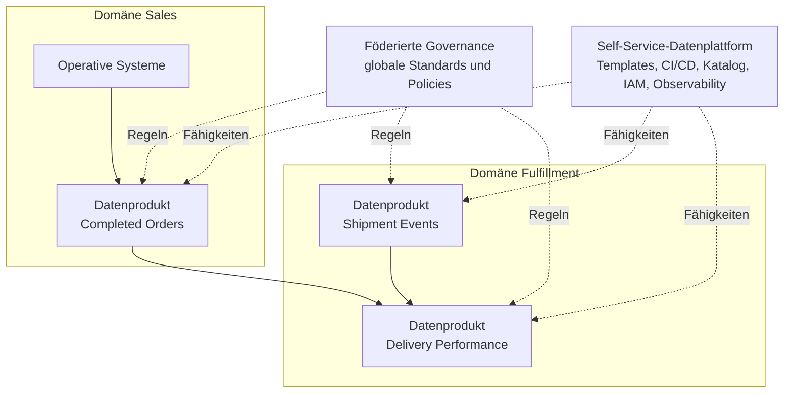

## Kurzfassung

**Data Mesh** ist ein soziotechnischer Ansatz für analytische Daten in großen, komplexen Organisationen. Fachliche Domänen übernehmen Ende-zu-Ende-Verantwortung für ihre Datenprodukte. Eine Self-Service-Datenplattform und föderierte, automatisierbare Governance ermöglichen gemeinsame Standards.

Die vier Prinzipien sind:

1. domänenorientierte, dezentrale Datenverantwortung;
2. Daten als Produkt;
3. Self-Service-Datenplattform;
4. föderierte, automatisierbare Governance.

**Merksatz:** Domänen besitzen Datenprodukte, die Plattform beseitigt technische Reibung und föderierte Regeln sichern Interoperabilität.

Data Mesh ist weder ein einzelnes Tool noch ein Tabellenmodell. Es verändert Verantwortlichkeiten, Produktdenken, Plattformfähigkeiten und Governance gemeinsam.

## Lernziele

Nach dieser Notiz solltest du:

- die vier Data-Mesh-Prinzipien erklären können;
- ein Datenprodukt von einem bloßen Dataset unterscheiden können;
- lokale und globale Governance-Entscheidungen trennen können;
- organisatorische Voraussetzungen und typische Fehlstarts erkennen;
- Data Mesh gegenüber [[Data Vault]] und [[Data Medallion Model]] abgrenzen können.

## Welches Problem löst Data Mesh?

Ein zentrales Datenteam wird häufig zum Engpass, wenn Zahl und Vielfalt der Quellen, Anwendungsfälle und Fachbereiche stark wachsen. Das Team muss fachliche Bedeutungen übersetzen, Prioritäten konkurrierender Bereiche ausgleichen und alle Pipelines betreiben.

Data Mesh verteilt Verantwortung entlang fachlicher **Bounded Contexts**. Teams, die den fachlichen Kontext und die operativen Systeme kennen, verantworten auch die daraus bereitgestellten analytischen Datenprodukte. Gemeinsame Plattform- und Governance-Fähigkeiten verhindern, dass daraus isolierte Datensilos entstehen.

Der Ansatz adressiert vor allem organisatorische Skalierung:

- viele Fachdomänen und Datenquellen;
- hohe Änderungsrate;
- zahlreiche unabhängige Konsumenten;
- lange Wartezeiten auf ein zentrales Datenteam;
- geringe fachliche Verantwortlichkeit für Datenqualität.

## Die vier Prinzipien

| Prinzip | Kerngedanke | Praktische Konsequenz |
|---|---|---|
| Domänenverantwortung | Verantwortung folgt fachlichen Domänen | Domänenteams bauen und betreiben analytische Datenprodukte |
| Daten als Produkt | Konsumenten sind Kunden des Datenprodukts | Klare Schnittstellen, Dokumentation, SLOs und Support |
| Self-Service-Plattform | Wiederkehrende Komplexität wird abstrahiert | Teams können Produkte sicher erstellen, deployen und beobachten |
| Föderierte Computational Governance | Globale Regeln und lokale Entscheidungen ergänzen sich | Standards werden gemeinsam beschlossen und möglichst automatisiert durchgesetzt |

Alle vier Prinzipien bilden zusammen den Data-Mesh-Ansatz. Dezentrale Ownership ohne Plattform und Governance erzeugt zusätzliche Silos. Eine Plattform ohne fachliche Produktverantwortung bleibt ein zentrales Infrastrukturprojekt.

## Prinzip 1: Domänenorientierte Verantwortung

Eine Domäne ist ein fachlich zusammenhängender Bereich mit eigener Sprache und Verantwortung, zum Beispiel:

- Customer;
- Orders;
- Fulfillment;
- Finance.

Das Domänenteam verantwortet den gesamten Lebenszyklus seiner analytischen Datenprodukte:

- fachliche Semantik;
- Transformationscode;
- Daten und Metadaten;
- Qualität und SLOs;
- Zugriffsregeln;
- Betrieb, Monitoring und Weiterentwicklung.

Domänengrenzen sollten fachlichen Verantwortungsgrenzen folgen. Ein technisch zugeschnittener Bereich wie „CSV-Daten“ oder „Spark-Pipelines“ ist keine Geschäftsdomäne.

## Prinzip 2: Daten als Produkt

Ein Dataset wird durch verlässliche Produkteigenschaften zu einem Datenprodukt. Dazu gehören:

- **auffindbar:** im Katalog registriert und suchbar;
- **verständlich:** fachliche Begriffe, Schema und Beispiele sind dokumentiert;
- **adressierbar:** besitzt stabile Namen und Zugriffspunkte;
- **vertrauenswürdig:** Qualität, Aktualität und bekannte Einschränkungen sind sichtbar;
- **sicher:** Zugriff und sensible Felder sind kontrolliert;
- **interoperabel:** gemeinsame Identifikatoren und Standards ermöglichen Kombinationen;
- **eigenständig nutzbar:** Konsumenten benötigen keine informelle Erklärung des Erstellerteams für Standardfälle.

### Minimaler Datenproduktvertrag

| Bereich | Inhalt |
|---|---|
| Zweck | Welche Nutzerentscheidung oder welchen Anwendungsfall unterstützt das Produkt? |
| Owner | Wer entscheidet fachlich und wer betreibt technisch? |
| Schnittstelle | Tabelle, View, Event, Datei oder API inklusive Versionierung |
| Semantik | Felddefinitionen, Grain, Einheiten und Schlüssel |
| SLOs | Aktualität, Verfügbarkeit, Vollständigkeit und Fehlerrate |
| Qualität | Tests, Schwellenwerte und Quarantäne-Verhalten |
| Sicherheit | Klassifikation, Zugriff, Aufbewahrung und Löschung |
| Lineage | Quellen, Transformationen und nachgelagerte Abhängigkeiten |
| Support | Kontaktweg, Incident-Prozess und Änderungsankündigungen |

**Beispiel:** Das Produkt `orders.completed` liefert eine versionierte, dokumentierte Sicht auf abgeschlossene Bestellungen. Es definiert eine Zeile pro Bestellung, Aktualität unter 15 Minuten und eine Eindeutigkeitsregel für `order_id`.

## Prinzip 3: Self-Service-Datenplattform

Die Plattform stellt wiederverwendbare Fähigkeiten als Produkt für Domänenteams bereit. Sie reduziert spezialisiertes Infrastrukturwissen und bietet einen **Paved Road** für den Lebenszyklus von Datenprodukten.

Typische Fähigkeiten:

- Produkt-Templates und deklarative Konfiguration;
- Speicher, Compute und Orchestrierung;
- CI/CD und Umgebungsmanagement;
- Schema Registry und Data Contracts;
- Katalog, Lineage und Discovery;
- Observability und Incident-Integration;
- Identitäts- und Zugriffsmanagement;
- Qualitätsprüfungen und Policy Enforcement;
- Kosten- und Nutzungsmetriken.

Die Plattform ist selbst ein Produkt. Ihre Kunden sind Datenproduktentwickler und Konsumenten. Erfolgsmetriken sind unter anderem kurze Bereitstellungszeiten, hohe Nutzung der Standardpfade und wenig manueller Plattform-Support.

## Prinzip 4: Föderierte Computational Governance

Domänenvertreter und Plattformverantwortliche definieren gemeinsam, welche Entscheidungen global und welche lokal getroffen werden. Globale Regeln dienen vor allem Sicherheit, Interoperabilität und regulatorischer Konformität.

| Global vereinheitlicht | Lokal durch die Domäne entschieden |
|---|---|
| Identitäts- und Zugriffsmodell | fachliche Qualitätsmetriken |
| Klassifikation sensibler Daten | Produktzuschnitt und Roadmap |
| Schema- und Vertragsstandards | interne Modellierung |
| Mindestanforderungen an SLOs | zusätzliche domänenspezifische SLOs |
| globale Identifikatoren | fachliche Transformationsregeln |
| Audit-, Retention- und Löschregeln | angebotene konsumorientierte Sichten |

„Computational“ bedeutet, dass Regeln soweit möglich maschinenlesbar und automatisch geprüft werden. Beispiele sind Policy as Code, verpflichtende Metadaten, Schema-Kompatibilitätschecks und automatisierte Zugriffskontrollen.

## Logische Architektur

Das Datenprodukt ist der eigenständig betreibbare Knoten im Mesh. Es umfasst Daten, Metadaten, Transformations- und Schnittstellencode sowie die benötigte Infrastrukturkonfiguration.

## Rollen und Verantwortlichkeiten

| Rolle | Verantwortung |
|---|---|
| Domain Data Product Owner | Nutzen, Roadmap, Qualität und Konsumentenbeziehungen |
| Data Product Developer | Implementierung, Tests, Deployment und Betrieb |
| Platform Product Team | Self-Service-Fähigkeiten und Developer Experience |
| Föderiertes Governance-Gremium | globale Standards und messbare Policies |
| Datenkonsument | Nutzung gemäß Vertrag und Feedback zu Produktanforderungen |

Eine RACI-Matrix pro Produkt verhindert Lücken zwischen fachlicher und technischer Verantwortung. Ein Produkt sollte einen eindeutigen verantwortlichen Bereich besitzen.

## Ein möglicher Einführungsweg

1. Einen wertvollen, domänenübergreifenden Use Case auswählen.
2. Domänengrenzen und eindeutige Produkt-Owner festlegen.
3. Ein oder zwei Datenprodukte rückwärts vom Konsumentenbedarf entwerfen.
4. Einen kleinen Plattformpfad für Deployment, Katalog, Qualität und Zugriff bereitstellen.
5. Wenige globale Standards automatisieren.
6. Lead Time, Produktnutzung, SLO-Erfüllung und Supportaufwand messen.
7. Weitere Domänen erst nach nachgewiesenem Nutzen anschließen.

Eine organisationsweite Reorganisation vor dem ersten funktionierenden Produkt erzeugt hohen Koordinationsaufwand. Ein vertikaler Pilot macht fehlende Plattform- und Governance-Fähigkeiten konkret sichtbar.

## Voraussetzungen

Data Mesh benötigt:

- tragfähige fachliche Domänen und autonome Teams;
- Bereitschaft zu echter Datenproduktverantwortung;
- Produktmanagement-Kompetenz;
- eine Plattformorganisation mit Self-Service-Fokus;
- automatisierbare Governance;
- gemeinsame Identitäten, Metadaten und Sicherheitsstandards;
- ausreichende organisatorische Größe und Komplexität.

Für kleine Organisationen mit wenigen Datenquellen ist ein zentrales Team oft einfacher. Produktdenken, Datenverträge und gute Plattformautomatisierung können trotzdem übernommen werden.

## Typische Fehlstarts

- **Tool-Rebranding:** Ein neuer Katalog oder eine Lakehouse-Plattform allein erzeugt kein Data Mesh.
- **Dezentralisierung ohne Fähigkeiten:** Domänenteams erhalten Verantwortung, aber keine Plattform, Zeit oder Datenkompetenz.
- **Datasets als Produkte etikettieren:** Owner, Vertrag, SLOs und Support fehlen.
- **Zentraler Freigabeprozess:** Jede Änderung wartet weiterhin auf ein Governance-Team.
- **Lokale Freiheit ohne globale Standards:** Produkte lassen sich nicht sicher kombinieren.
- **Technische Domänen:** Teams werden nach Tools oder Pipeline-Schritten statt nach Geschäftsfähigkeiten geschnitten.
- **Output statt Outcome messen:** Die Zahl registrierter Datenprodukte sagt wenig über tatsächliche Nutzung und Wert aus.

## Erfolgsmetriken

Sinnvolle Messgrößen beziehen sich auf Produktnutzung und Betriebsfähigkeit:

- Zeit von der Produktidee bis zur ersten sicheren Nutzung;
- Zeit eines Konsumenten von Discovery bis zur ersten Abfrage;
- aktive Konsumenten und nachgelagerte Produkte;
- Erfüllung der Produkt-SLOs;
- Datenqualitäts-Incidents und Wiederherstellungszeit;
- Anteil automatisiert geprüfter Policies;
- Nutzung der Self-Service-Plattform;
- Kosten je genutztem Datenprodukt.

## Abgrenzung und Kombination

| Konzept | Leitfrage | Ebene |
|---|---|---|
| Data Mesh | Wer besitzt und betreibt analytische Datenprodukte? | Organisation, Governance und Plattform |
| [[Data Vault]] | Wie speichern wir integrierte Historie änderungsrobust? | Datenmodell und Methodik |
| [[Data Medallion Model]] | In welchen Qualitätsstufen verarbeiten wir Daten? | Pipeline- und Schichtenmuster |

Eine Domäne kann ihr Datenprodukt intern mit Data Vault modellieren und seine Pipeline nach Bronze, Silver und Gold gliedern. Data Mesh verlangt keine bestimmte Speichertechnologie oder Tabellenstruktur. Entscheidend sind Produktverantwortung, nutzbare Schnittstellen, Self-Service und föderierte Standards.

## Wiederholungsfragen

1. Warum ist dezentrale Ownership allein noch kein Data Mesh?
2. Wodurch wird ein Dataset zu einem Datenprodukt?
3. Welche Fähigkeiten gehören auf die Self-Service-Plattform?
4. Welche Regeln sollten global gelten, welche lokal?
5. Warum sind technisch definierte Domänen problematisch?
6. Woran lässt sich der Erfolg eines Data Mesh messen?

## Quellen und Vertiefung

- [Zhamak Dehghani: Data Mesh Principles and Logical Architecture](https://martinfowler.com/articles/data-mesh-principles.html)
- [Martin Fowler: Designing Data Products](https://martinfowler.com/articles/designing-data-products.html)

