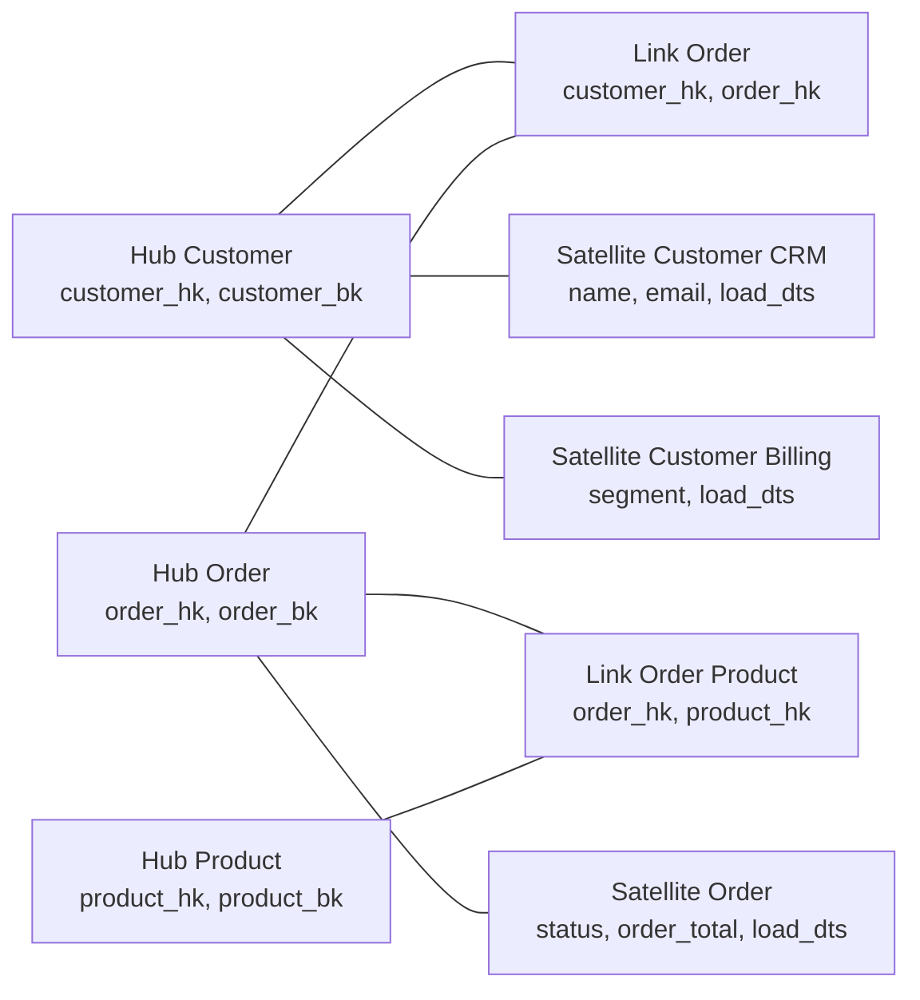
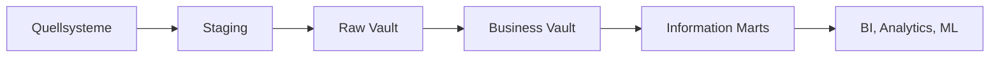

## Kurzfassung

**Data Vault** ist ein Modellierungsansatz für die integrierte, historisierte und auditierbare Kernschicht eines Data Warehouse oder Lakehouse. Das Modell trennt stabile Geschäftsidentitäten, ihre Beziehungen und ihre veränderlichen Eigenschaften.

Die drei Grundbausteine sind:

- **Hub:** eindeutige Business Keys, zum Beispiel `customer_id`
- **Link:** Beziehungen oder Transaktionen zwischen Business Keys
- **Satellite:** beschreibende Attribute und deren Historie

**Merksatz:** Hubs benennen Geschäftsdinge, Links verbinden sie, Satellites beschreiben sie über die Zeit.

Data Vault 2.0 erweitert das Datenmodell um Architektur-, Entwicklungs- und Automatisierungspraktiken. Die Datenbereitstellung für BI erfolgt meist über dimensionale Information Marts wie [[02 Dimensional Modeling Kimball|Star Schemas]].

## Lernziele

Nach dieser Notiz solltest du:

- Hub, Link und Satellite sicher unterscheiden können;
- Raw Vault, Business Vault und Information Mart einordnen können;
- die Rolle von Business Keys, Hash Keys und Historisierung verstehen;
- passende und unpassende Einsatzsituationen erkennen;
- Data Vault gegenüber [[Data Mesh]] und [[Data Medallion Model]] abgrenzen können.

## Welches Problem löst Data Vault?

Klassische Enterprise Data Warehouses werden schwer änderbar, wenn viele Quellsysteme, wechselnde Schemata und neue Geschäftsregeln zusammenkommen. Data Vault zerlegt das integrierte Modell in kleine, weitgehend additive Strukturen. Neue Quellen ergänzen bestehende Hubs und Links häufig durch neue Satellites, ohne die vorhandene Historie umzubauen.

Der Ansatz wird vor allem eingesetzt, wenn folgende Anforderungen zusammentreffen:

- vollständige Historisierung;
- Nachvollziehbarkeit bis zum Quellsystem;
- häufige Änderungen an Quellen oder Geschäftsregeln;
- parallele Ladeprozesse;
- Integration vieler heterogener Quellen;
- regulatorische oder revisionsbezogene Anforderungen.

## Das Kernmodell

### Hub

Ein Hub repräsentiert eine stabile Geschäftsidentität.

| Bestandteil | Bedeutung |
|---|---|
| Business Key | Fachlicher Schlüssel aus der Geschäftswelt, zum Beispiel `customer_number` |
| Hash Key oder Surrogate Key | Technischer, konsistenter Schlüssel des Hubs |
| Load Timestamp | Zeitpunkt der Aufnahme in den Vault |
| Record Source | Herkunft des Datensatzes |

Ein Hub enthält möglichst keine beschreibenden Attribute. Eine neue E-Mail-Adresse verändert den Kunden-Hub daher nicht.

**Beispiel:** `hub_customer(customer_hk, customer_bk, load_dts, record_source)`

### Link

Ein Link repräsentiert eine Beziehung, Assoziation oder Transaktion zwischen Hubs. Links können zwei oder mehr Hubs verbinden.

**Beispiele:**

- Kunde gibt Bestellung auf;
- Bestellung enthält Produkt;
- Mitarbeiter gehört Organisationseinheit an.

Ein Link speichert die Schlüssel der beteiligten Hubs sowie eigene Lade-Metadaten. Beschreibende Eigenschaften der Beziehung gehören in einen Satellite am Link.

**Beispiel:** `link_customer_order(customer_order_hk, customer_hk, order_hk, load_dts, record_source)`

### Satellite

Ein Satellite enthält Attribute und ihre zeitliche Entwicklung. Er ist an genau einen Hub oder Link gebunden. Eine neue fachliche Version wird als neue Zeile eingefügt.

Typische Spalten sind:

- Parent Key des Hubs oder Links;
- fachliche Attribute;
- `load_dts`;
- optional `load_end_dts` oder Ableitungen für Gültigkeitsintervalle;
- `record_source`;
- häufig ein Hash Diff zur Änderungserkennung.

Satellites werden sinnvoll nach Quelle, Änderungsrate oder fachlicher Zusammengehörigkeit getrennt. Dadurch kann sich beispielsweise die Kundenadresse unabhängig vom selten geänderten Geburtsdatum entwickeln.

## Schlüssel und Änderungsverfolgung

### Business Key

Der Business Key identifiziert ein Geschäftsobjekt quellsystemübergreifend. Seine Auswahl ist eine fachliche Entscheidung. Ein technischer Primärschlüssel aus einer einzelnen Datenbank eignet sich nur, wenn er tatsächlich die fachliche Identität repräsentiert.

### Hash Key

Data Vault 2.0 verwendet häufig deterministische Hash Keys, damit Hubs und Links parallel geladen werden können. Der Hash wird aus kanonisierten Business Keys gebildet.

Wichtige Regeln:

- Datentypen und Zeichenkodierung vereinheitlichen;
- Leerzeichen, Groß- und Kleinschreibung sowie `NULL` konsistent behandeln;
- Spaltenreihenfolge für zusammengesetzte Keys fest definieren;
- einen ausreichend kollisionsresistenten Algorithmus verwenden;
- Hash-Logik zentral implementieren und testen.

### Hash Diff

Ein Hash Diff fasst die historisierten Attribute eines Satellite-Datensatzes zusammen. Unterscheidet er sich von der zuletzt geladenen Version, wird eine neue Zeile geschrieben. Er beschleunigt den Vergleich, ersetzt aber keine klare Definition der verglichenen Attribute.

## Schichten einer typischen Data-Vault-Architektur

| Schicht | Inhalt | Regel |
|---|---|---|
| Staging | Kurzlebige, quellnahe Vorbereitung | Technische Standardisierung und Ladevorbereitung |
| Raw Vault | Hubs, Links und Satellites aus den Quellen | Rohhistorie mit möglichst wenigen Geschäftsregeln |
| Business Vault | Abgeleitete Satellites, Regeln, PIT- und Bridge-Tabellen | Versionierte fachliche Ableitungen |
| Information Marts | Fakten, Dimensionen und konsumorientierte Views | Für konkrete Analyse- und Performance-Anforderungen |

### Raw Vault

Der Raw Vault bewahrt die integrierte Quellhistorie. Zulässig sind technische Regeln wie Formatvereinheitlichung, Schlüsselbildung und Duplikaterkennung. Veränderliche fachliche Interpretationen werden hier möglichst vermieden.

### Business Vault

Der Business Vault ergänzt abgeleitete und versionierte Geschäftslogik. Beispiele sind:

- konsolidierte Kundenklassifikation;
- berechnete Statusfolgen;
- **Point-in-Time Tables (PIT)** zur schnelleren zeitlichen Rekonstruktion;
- **Bridge Tables** für häufig benötigte Beziehungswege;
- berechnete Satellites.

### Information Marts

Data Vault ist für flexible Integration und Historisierung optimiert. Viele Hubs, Links und Satellites führen bei direkter BI-Nutzung zu komplexen Joins. Information Marts übersetzen den Vault deshalb in konsumorientierte Modelle, häufig [[02 Dimensional Modeling Kimball|dimensionale Modelle]].

## Durchgängiges Beispiel

Angenommen, CRM und Billing liefern Kundendaten:

1. `C-4711` wird als Business Key in `hub_customer` aufgenommen.
2. CRM-Attribute landen in `sat_customer_crm`.
3. Billing-Attribute landen in `sat_customer_billing`.
4. Eine Bestellung `O-815` wird in `hub_order` aufgenommen.
5. `link_customer_order` verbindet Kunde und Bestellung.
6. Ändert sich die E-Mail-Adresse, entsteht eine neue Zeile in `sat_customer_crm`.
7. Ein Information Mart erzeugt daraus `dim_customer` und `fact_order` für BI.

Die alte E-Mail-Adresse bleibt rekonstruierbar. Das Billing-System kann unabhängig neue Attribute liefern.

## Ladeprinzipien

Ein robuster Ladeprozess folgt typischerweise diesen Regeln:

1. Quelldaten unverändert oder nachvollziehbar im Staging erfassen.
2. Business Keys kanonisieren und technische Metadaten hinzufügen.
3. neue Hub-Datensätze idempotent einfügen;
4. Beziehungen als Links ergänzen;
5. Satellite-Versionen nur bei Änderungen anlegen;
6. fehlerhafte Datensätze quarantänisieren und beobachtbar machen;
7. Business-Vault-Regeln und Marts nachgelagert berechnen.

Hubs, Links und Satellites sind überwiegend insert-only. Korrekturen sollten als nachvollziehbare neue Zustände oder kontrollierte technische Reparaturen behandelt werden.

## Stärken und Grenzen

| Stärken | Grenzen |
|---|---|
| vollständige Historie und gute Auditierbarkeit | viele Tabellen und Joins |
| additive Erweiterbarkeit | hohe Modellierungs- und Automatisierungsdisziplin |
| parallele, skalierbare Loads | für direkte BI-Nutzung oft ungeeignet |
| klare Trennung von Quelle und Geschäftsregel | Business-Key-Fehler wirken strukturell |
| gute Lineage durch technische Metadaten | kleine, stabile Datenlandschaften profitieren weniger |

Data Vault passt gut zu großen, veränderlichen Integrationsplattformen. Für einen kleinen Data Mart mit wenigen stabilen Quellen kann ein direktes dimensionales Modell deutlich einfacher sein.

## Abgrenzung und Kombination

| Konzept | Leitfrage | Ebene |
|---|---|---|
| Data Vault | Wie speichern wir integrierte Historie änderungsrobust? | Datenmodell und Methodik |
| [[Data Mesh]] | Wer besitzt und betreibt analytische Datenprodukte? | Organisation, Governance und Plattform |
| [[Data Medallion Model]] | In welchen Qualitätsstufen verarbeiten wir Daten? | Pipeline- und Schichtenmuster |
| [[02 Dimensional Modeling Kimball\|Dimensional Modeling]] | Wie machen wir Daten für Analyse leicht verständlich und schnell? | Konsumorientiertes Datenmodell |

Die Konzepte können gemeinsam eingesetzt werden. In einer Medallion-Architektur kann ein Raw Vault in Bronze oder zwischen Bronze und Silver beginnen, während Business Vault und konsumierbare Modelle in Silver und Gold liegen. Die genaue Zuordnung ist eine Architekturentscheidung und keine feste Regel. In einem Data Mesh kann jeder fachliche Bereich Data Vault intern verwenden, sofern sein Datenprodukt klare Schnittstellen und Verantwortlichkeiten besitzt.

## Typische Fehlannahmen

- **„Data Vault ist ein fertiges Reporting-Modell.“** Für BI werden meist Information Marts benötigt.
- **„Jeder Quellschlüssel ist automatisch ein Business Key.“** Business Keys müssen fachliche Identität tragen.
- **„Alles gehört in den Raw Vault.“** Veränderliche Geschäftslogik gehört in den Business Vault.
- **„Hashing löst Datenqualität.“** Hashes vereinfachen Schlüsselbildung und Vergleiche. Semantik und Quellfehler bleiben fachliche Aufgaben.
- **„Mehr Satellites sind immer besser.“** Die Zerlegung braucht einen begründeten Schnitt nach Quelle, Änderungsrate oder fachlicher Kohäsion.

## Entscheidungscheck

Data Vault ist ein guter Kandidat, wenn die meisten Aussagen zutreffen:

- Wir integrieren viele Quellen mit häufigen Änderungen.
- Historie und Herkunft müssen vollständig nachvollziehbar sein.
- Neue Quellen sollen ohne umfangreichen Umbau anschließbar sein.
- Paralleles Laden und Automatisierung sind wichtig.
- Das Team kann Modellierungsstandards, Tests und Metadaten konsequent betreiben.

Wenn Geschwindigkeit bis zum ersten Dashboard wichtiger ist als langfristige Integrationsflexibilität, sollte zunächst ein kleineres dimensionales Modell geprüft werden.

## Wiederholungsfragen

1. Warum enthält ein Hub keine Kundenadresse?
2. Wann gehört ein Attribut in einen Link-Satellite?
3. Welche fachliche Entscheidung steckt hinter einem Business Key?
4. Warum trennt man Raw Vault und Business Vault?
5. Welche Aufgabe übernehmen Information Marts?
6. Welche Fehler kann ein Hash Key nicht lösen?

## Quellen und Vertiefung

- [Data Vault Alliance: Data Vault 2.0 – An Introduction](https://datavaultalliance.com/engineering/data-vault-2-0-an-introduction/)
- [Data Vault Alliance: Suggested Object Naming Conventions](https://datavaultalliance.com/engineering/data-vault-2-0-suggested-object-naming-conventions/)

